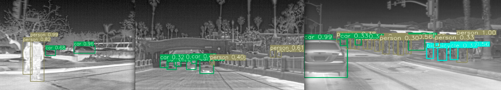

## 热图像识别
本项目为重庆大学娄歆悦（1205646746@qq.com）人工智能应用型 - 红外图像目标检测项目

使用yolov3 spp模块，改进数据预处理， 缩小识别范围提高了对小物体的识别精度，识别效果如下图


#### 最终结果

   1. <strong>mAP:</strong> ```0.961```
   2. <strong>Recall:</strong> ```0.922```
   3. <strong>F1:</strong> ```0.857```
   


#### 使用说明

- 使用含有GPU的设备进行加速训练

- 解压项目

- 下载预训练权重文件资源 here: [link](https://drive.google.com/drive/folders/1dV0OmvG4eZFtnh5WF0mby-jhkVy-HVco?usp=sharing)
   
- 下载FLIR数据集，将数据集使用工具进行转化，[Download](https://www.flir.com/oem/adas/adas-dataset-form/)

- 使用修改后的spp配置文件 ```/cfg/yolov3-spp-r.cfg```.

- 使用自定义识别类别配置文件 ```/data/custom.names``` and ```custom.data```.


#### 运行说明

 - 运行命令下载预训练文件 ``` bash yolov3/data/get_coco_dataset.sh```, 将数据集文件放置在如下目录 ```/coco/images/FLIR_Dataset```. 
 使用命令进行训练

$  ```python3 detect.py --data data/custom.data --cfg cfg/yolov3-spp-r.cfg --weights weights/custom.pt```

- 使用命令 进行训练过程的绘图

  $ ```python (python cmd prompt)```
  
  $ ```from utils import utils```
  
  $ ```utils.plot_results()```
  

- 使用命令进行验证
$ ```python3 test.py --cfg cfg/yolov3-spp-r.cfg --weights weights/custom.pt --data data/custom.data```

